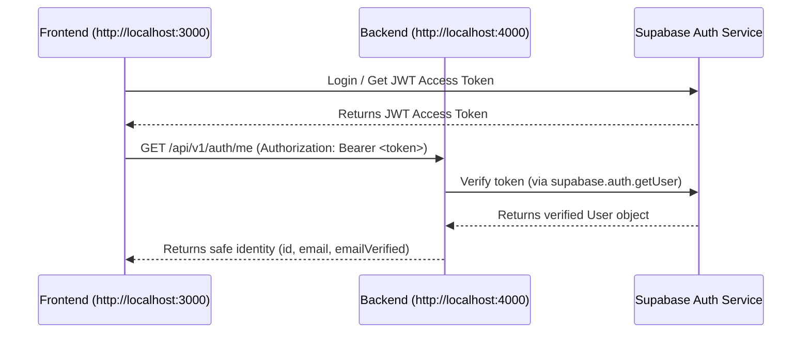

# ProjectLink Backend (projectlink-backend)

This is the NestJS backend foundation for the project. It provides a robust, production-ready foundation with Prisma ORM, Supabase Auth integration, rate limiting, security headers, and Swagger documentation.

## Prerequisites

- **Node.js**: v18.0.0 or higher (v20+ recommended)
- **npm**: v9.0.0 or higher
- **PostgreSQL**: A running instance or a Supabase project (for later phases)

## Installation

Navigate to the backend directory and install the dependencies:

```bash
cd backend
npm install
```

## Environment Setup

Copy the example environment file and configure the variables:

```bash
cp .env.example .env
```

### Environment Variables

| Variable | Description | Default / Example |
|---|---|---|
| `NODE_ENV` | Application environment (`development`, `production`, `test`) | `development` |
| `PORT` | The port the backend server listens on | `4000` |
| `FRONTEND_URL` | The URL of the frontend application (for CORS) | `http://localhost:3000` |
| `DATABASE_URL` | PostgreSQL connection string for Prisma | `postgresql://...` |
| `SUPABASE_URL` | The API URL of your Supabase project | `https://your-project.supabase.co` |
| `SUPABASE_PUBLISHABLE_KEY` | The anon/public key of your Supabase project | `eyJhbGciOi...` |
| `SUPABASE_SECRET_KEY` | The service_role secret key (DO NOT expose to frontend) | `eyJhbGciOi...` |

> [!WARNING]
> **Security Warning**: The `SUPABASE_SECRET_KEY` (service role key) bypasses all Row Level Security (RLS) policies. It should **never** be shared, committed to version control, or exposed to the frontend.

## Available Commands

### Development

Start the application in development mode with hot-reload:

```bash
npm run start:dev
```

### Production Build

Build the application for production:

```bash
npm run build
```

Start the production build:

```bash
npm run start:prod
```

### Code Quality & Testing

Run ESLint to check and fix code style:

```bash
npm run lint
```

Run unit tests:

```bash
npm test
```

Run end-to-end tests:

```bash
npm run test:e2e
```

## API Access

- **Base API URL**: `http://localhost:4000/api/v1`
- **Swagger Documentation URL**: `http://localhost:4000/docs`

---

## Current Architecture & Design Decisions

### 1. Why Database Models Are Intentionally Missing
The Supabase database schema has not been finalized yet. To avoid making premature assumptions about profiles, projects, applications, roles, or achievements, **no database models or migrations are present**. 

Supabase SQL migrations will remain the database schema source of truth. In a later phase, once the ER diagram is approved, Prisma will introspect the database using `prisma db pull` and generate the local client models.

### 2. Database Connection Resilience
The `PrismaService` is designed to be resilient during the foundation stage:
- It only attempts to connect to the database if `DATABASE_URL` is configured.
- If `DATABASE_URL` is missing or the database is offline, it logs a warning but **does not crash the application**.
- This ensures the health check and other non-database endpoints remain fully functional.

### 3. Supabase Authentication Flow
Authentication is handled via the `SupabaseAuthGuard`. Here is how the flow works:



1. The frontend authenticates directly with Supabase and receives an access token (JWT).
2. The frontend includes this token in the `Authorization` header as `Bearer <token>` when calling protected backend endpoints.
3. The backend's `SupabaseAuthGuard` extracts the token and validates it against Supabase using `supabase.auth.getUser(token)`.
4. If valid, the backend attaches the user to the request context (`request.user`) and allows the request. Otherwise, it returns `401 Unauthorized`.
5. **No client-supplied roles are trusted**. All authorization will be performed server-side.
